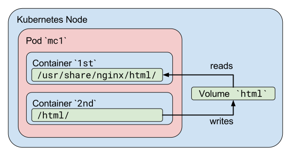

# Lab Session 2 - Kubernetes

## The Kubernetes Cluster

Ask Gemini to create a new Google Kubernetes Engine cluster. Use a prompt like this and think why this is a good prompt:

```text
Using gcloud, create a regional, three nodes GKE cluster named `my-cluster` using the shortest command line possible. The region should be `europe-west1`.
```

The proposed command should be something as this:

```bash
gcloud container clusters create my-cluster --num-nodes=3 --region=europe-west1
```

**Question**: What does it mean that you're specifying a region there?

**Answer**: The region is where the cluster is going to be created. By defining it, you're choosing the [Cluster availability type](https://cloud.google.com/kubernetes-engine/docs/concepts/types-of-clusters#availability). It's important to choose a region that's close to the users of the application to reduce latency but in the end, you will see that using globally available services like Cloud Run or Cloud Functions can help you reduce the need for this kind of decision, as they are closer to the experience the developer would like to have.

The cluster will take some time to create (**why?** because Google Cloud is creating a Kubernetes Control Plane and bootstrapping the Compute Engine VMs to become Kubernetes nodes). Once it's ready, you can check the status of the cluster. Ask Gemini to show you how to do it. Try different prompts, one that should work given the previous one is this:

```text
Using gcloud, get the nodes of the cluster you've just created.
```

For this prompt to work best, you should not delete the Gemini Code Assist output from the previous command, as the answer provided by Gemini and your previous prompt will be used as input.

The two commands proposed in this case are these:

```bash
# Using the `kubectl` command
gcoud container clusters get-credentials my-cluster --region=europe-west1
kubectl get nodes
```

```bash
# Using the `gcloud` command
gcloud container clusters describe my-cluster --region=europe-west1
```

Both achieve what you want. You can also go to the [Google Cloud Console](https://console.cloud.google.com/kubernetes) and check the status of the cluster there. Make sure that you select the right project.

**Question**: What's the difference between the `kubectl` and `gcloud` commands? Why do you think it's necessary to get the credentials of the cluster before using `kubectl`?

**Answer**: The `kubectl` command goes directly against the Kubernetes API, while the `gcloud` command consumes the GCP GKE APIs to achieve the same result. For `kubectl` to work, it's necessary to get the credentials of the cluster before using `kubectl` because the `kubectl` command needs to know where the cluster is and how to authenticate against it. Otherwise, as your GKE Kubernetes API endpoint is actually public, anyone could access it.

## Deploying an application - Your first pod

You're going to deploy a simple application to the cluster. To continue with the example you started in the previous session, create the same app that you created there and deploy it to the cluster.

The steps you would need to follow are the following. Before proceeding, try to do steps 1 to 4 by yourself. If you get stuck, ask Gemini for help and use the materials from [./session1.md](Lab 1). Try to do steps 1 to 3 by yourself. If you get stuck, ask Gemini for help. Once you have the image in Artifact Registry, ask Gemini to show you how to create the pod manifest and deploy it to the cluster, and compare the answer with the provided solution below.

1. Set up a folder for your work:

    ```bash
    mkdir $HOME/hello
    cd $HOME/hello
    ```

    Set Cloud Shell Editor to use the new folder as the workspace:

    ```bash
    cloudshell open-workspace .
    ```

2. Create the app file `hello.py`, and the requirements file, `requirements.txt`, into the `hello` folder.

    Python file, `hello.py`:

    ```python
    #!/usr/bin/env python

    from flask import Flask
    app = Flask(__name__)

    @app.route('/')
    def hello_world():
    return 'Hello World!'

    if __name__ == '__main__':
    app.run(host='0.0.0.0', port=8080)
    ```

    Requirements file, `requirements.txt`:

    ```text
    flask
    gunicorn
    ```

3. Create a Dockerfile:

    ```yaml
    FROM python:3.12.3-slim

    WORKDIR /app

    ADD . /app

    RUN pip install --no-cache-dir -r requirements.txt

    EXPOSE 8080

    CMD ["gunicorn", "-b", "0.0.0.0:8080", "hello:app"]
    ```

4. Build the image and push it to Artifact Registry, using Cloud Build to build the image and push it to Artifact Registry:

    ```bash
    gcloud artifacts repositories create my-repo --repository-format=docker --location=europe-west1
    ```

    ```bash
    gcloud builds submit -t europe-west1-docker.pkg.dev/$PROJECT_ID/my-repo/hello .
    ```

5. Create a pod manifest and deploy it to the cluster

    Create a file `hello-pod.yaml.template`:

    ```yaml
    apiVersion: v1
    kind: Pod
    metadata:
      name: hello-pod
      labels:
        app: hello
    spec:
      containers:
      - name: hello-container
        image: europe-west1-docker.pkg.dev/$PROJECT_ID/my-repo/hello:latest
        ports:
        - containerPort: 8080
        env:
        - name: PORT
          value: "8080"
    ```

    Customize the manifest with the `envsubst` command so you get the right PROJECT_ID value in the file:

    ```bash
    envsubst < hello-pod.yaml.template > hello-pod.yaml
    ```

    Note the tag `latest` in the image URL. This is not a good practice, but it's used here for simplicity. You should always use a specific tag for your images that reflects the application version that you're deploying.

**Question**: What's the difference between a pod and a container? Does it matter for this particular example?

**Answer**: The answer to this question is elaborated in a section below. Basically, a pod is a group of one or more containers that share the same network and storage. In this example, you're deploying a single container, so the difference doesn't matter much in this particular case.

**Question**: Given that Kubernetes can inject environment variables into the pods, how would you inject the `PORT` environment variable into the pod?

**Answer**: You can inject environment variables into the pod using the `env` field in the container spec. In this case, you're injecting the `PORT` environment variable with the value `8080`, but so far your application code is not reading any environment value, and the port is hardcoded in the application code. 

So, based on the answer to the previous question, you can see you can do better. Change the application code, and the Dockerfile, so both read the `PORT` environment variable. Both files should now look like this:

Python file, `hello.py`:

```python
#!/usr/bin/env python
import os
from flask import Flask

app = Flask(__name__)

@app.route('/')
def hello_world():
  return 'Hello World!'

if __name__ == '__main__':
  port = int(os.environ.get('PORT', 8080))
  app.run(host='0.0.0.0', port=port)
```

Dockerfile:

```yaml
FROM python:3.12.3-slim

ENV PORT 8080

WORKDIR /app

ADD . /app

RUN pip install --no-cache-dir -r requirements.txt

EXPOSE $PORT

CMD exec gunicorn --bind 0.0.0.0:$PORT hello:app
```

Take a moment to explore the differences between the two versions of the application code and the Dockerfile. The application code now reads the `PORT` environment variable, and the Dockerfile sets the `PORT` environment variable to `8080`. This way, you can change the port the application listens on by setting the `PORT` environment variable when you deploy the application.

So now that you've got an improved version of your application and Dockerfile, your should rebuild the container image and push it to Artifact Registry:

```bash
gcloud builds submit -t europe-west1-docker.pkg.dev/$PROJECT_ID/my-repo/hello .
```

Note how in the previous command you used the same tag as before. As there's explicit tage set for the image, `latest` will be used.

The pod manifest file is created, and you didn't change the image URL when building the image, so you can use the same `hello-pod.yaml` file you created before. Apply the pod manifest to the cluster using the following command:

```bash
kubectl apply -f hello-pod.yaml
```

You can check the status of the pod using the following command:

```bash
kubectl get pods
```

You can also check the logs of the pod using the following command:

```bash
kubectl logs hello-pod
```

Finally, you can access the pod using the following command:

```bash
kubectl port-forward hello-pod 8080:8080
```

**Question**: Is this a valid, production ready way to access the application? Why?

**Answer**: This is not a valid, production-ready way to access the application. The `port-forward` command is useful for debugging and development purposes, but it's not suitable for production environments (to learn more about how port forwarding works, read [this Stack Overflow answer](https://stackoverflow.com/a/51476393), or you could ask Gemini Code Assist `how does kubectl port-forward works?`). In a production environment, you would typically expose the application using a service, which provides a stable endpoint for accessing the application. You will learn about services in the next steps.

## Pods or Containers?

You will now do a quick exercise to understand the difference between pods and containers.

Create a pod with two containers. The first container should be an Nginx container that serves a simple HTML page. The second container should be a Debian container that writes the current date to the HTML page every second. Name the file `mc1.yaml`:

```yaml
apiVersion: v1
kind: Pod
metadata:
  name: mc1
  labels:
    app: mc1
spec:
  volumes:
  - name: html
    emptyDir: {}
  containers:
  - name: 1st
    image: nginx
    volumeMounts:
    - name: html
      mountPath: /usr/share/nginx/html
  - name: 2nd
    image: debian
    volumeMounts:
    - name: html
      mountPath: /html
    command: ["/bin/sh", "-c"]
    args:
      - while true; do
          date >> /html/index.html;
          sleep 1;
        done
```

Before you create the pod, ask Gemini to explain the manifest to you. Make sure the file `mc1.yaml` is active in the Cloud Shell Editor so Gemini understands this is the context of your prompt, and ask Gemini Code Assist `Explain this file to me`.

Once you understand it, create the pod, but instead of doing it in the `default` namespace, do it in a new namespace named `test` that you need to create first. Ask Gemini to show you how to do it. The `kubectl` command you should use is the following:

```bash
kubectl create namespace test
```

Then, apply the pod manifest:

```bash
kubectl apply -f mc1.yaml -n test
```

Once you have the pod running, ask Gemini to show you how to access the HTML page that the Nginx container is serving. A valid prompt would be, having the `mc1.yaml` file open, something like `Using kubectl, port forward this pod to the 8080 port of my machine`. The command you should use is the following:
  
```bash
kubectl port-forward mc1 8080:80
```

You can inspect what's happening inside the pod running the `cat` command in both containers:

```bash
kubectl -n test exec -it mc1 -c 1st -- cat /usr/share/nginx/html/index.html
kubectl -n test exec -it mc1 -c 2nd -- cat /html/index.html
```

**Question**: Can you explain what's going on when you access the page?

**Answer**: The Nginx container serves a simple HTML page that contains the current date. The Debian container writes the current date to the HTML page every second. When you access the page, you see the current date, and if you refresh the page, you see the date updating every second. This diagram depicts the situation, extracted from [this useful tutorial](https://linchpiner.github.io/k8s-multi-container-pods.html):

<p align="center">
  
</p>

## Kubernetes resiliency - Deployments

Before moving forward, delete the `hello-pod` pod you created before from the `default` namespace. Ask Gemini to show you how to do it (Prompt could be something like `Delete the pod you created before`, if you used Gemini Code assist to give you a solution on how to create the pod in the first place). In any case, the command to delete the pod would be this:

```bash
kubectl delete pod hello-pod
```

Create a new container image for the `hello` app that reads an environment variable called `VERSION` and renders an HTML page saying `Hello world from <version>`, where `<version>` is the value of the environment variable. Build the image and push it to Artifact Registry, tagging this image as `v1` (the tag should be something as `europe-west1-docker.pkg.dev/$PROJECT_ID/my-repo/hello:v1`). Ask Gemini to show you how to do it.

The new `hello.py` file should look like this:

```python
#!/usr/bin/env python
import os
from flask import Flask

app = Flask(__name__)

@app.route('/')
def hello_world():
  version = os.environ.get('VERSION', 'unknown')
  return f'Hello World version {version}!'

if __name__ == '__main__':
  port = int(os.environ.get('PORT', 8080))
  app.run(host='0.0.0.0', port=port)
```

You don't need to change the Dockerfile, as it should be agnostic about the application version. But as you've got a new version of the application code, you should rebuild the  image and push it to Artifact Registry, now with a explicit `v1` tag set:

```bash
gcloud builds submit -t europe-west1-docker.pkg.dev/$PROJECT_ID/my-repo/hello:v1 .
```

Create a Kubernetes deployment for the `hello` app. The deployment should have the following characteristics:

- It shoud have 3 replicas
- It should use the pod manifest you created before as template
- Remember to use the proper selector to match the labels in the pod manifest

Ask Gemini Code Assist to show you how to create the deployment, using different variations of the prompt and selecting the right file tab to act as the right context. The file should look like this, save it as `hello-deployment.yaml.template`:

```yaml
apiVersion: apps/v1
kind: Deployment
metadata:
  name: hello-deployment
  labels:
    app: hello
spec:
  replicas: 3
  selector:
    matchLabels:
      app: hello
  template:
    metadata:
      labels:
        app: hello
    spec:
      containers:
      - name: hello-container
        image: europe-west1-docker.pkg.dev/$PROJECT_ID/my-repo/hello:v1
        ports:
        - containerPort: 8080
        env:
        - name: PORT
          value: "8080"
```

Because this file has a `$PROJECT_ID` variable, you need to substitute it with the actual value to become a valid Kubernetes manifest. The process of substituting the variable is called interpolation, and you can do this using the `envsubst` command:

```bash
envsubst < hello-deployment.yaml.template > hello-deployment.yaml
```

So now that you've got the `hello-deployment.yaml`, create it into the `default` namespace:

```bash
kubectl apply -f hello-deployment.yaml
```

Then, check the status of the deployment using the following command:

```bash
kubectl describe deployment hello-deployment
```

List the pods created by the deployment, using the `app=hello` label to filter the pods:

```bash
kubectl get pods -l app=hello
```

Now, using the pod name of one of the three pods in the deployment listed in the output of the above command, delete it to see what happens:

```bash
kubectl delete pod <POD_NAME>
```

Observe how the deployment creates a new pod to replace the one you deleted:

```bash
kubectl get pods -l app=hello
```

**Question:** Can you determine the location of the pods in the cluster? How are they distributed?

**Answer:** The pods are distributed across the nodes in the cluster. Kubernetes schedules the pods on the nodes based on the resource requirements of the pods and the available resources on the nodes. You can see the nodes where the pods are running by running the following command:

```bash
kubectl get pods -o wide
```

### Scaling the application by increasing the replica count

Now, scale up the application up to 5 replicas. With the Cloud Shell Editor tab containing the `hello-deployment.yaml` active, ask Gemini Code Assist to show you how to do it. The result should be the same file, but with the `replicas` field set to `5`:

```yaml
apiVersion: apps/v1
kind: Deployment
metadata:
  name: hello-deployment
  labels:
    app: hello
spec:
  replicas: 3
  selector:
    matchLabels:
      app: hello
  template:
    metadata:
      labels:
        app: hello
    spec:
      containers:
      - name: hello-container
        image: europe-west1-docker.pkg.dev/$PROJECT_ID/my-repo/hello:v1
        ports:
        - containerPort: 8080
        env:
        - name: PORT
          value: "8080"
```

**Question**: Compare the pods of the new deployment and the previous one. What's the difference? Did the deployment create new pods or did it reuse the existing ones?

**Answer**: The deployment created new pods to match the desired state. The deployment keeps the existing pods running and creates new ones to match the desired state. This way, the deployment ensures that the application is always available and that the desired number of replicas is maintained.

**Question**: So far, you've been accessing pods using port-forwarding, but this is going straight to the pods. How would you access the application if you have multiple replicas?

**Answer**: To access the application when you have multiple replicas, you would typically create a service that exposes the application to the outside world. The service provides a stable endpoint for accessing the application, and it can load balance traffic across the pods that are replicas of the services. You will learn about services in the next steps

## Exposing Kubernetes applications - Services

You're now going to expose the deployment you created in the previous step. Create a service manifest file named `hello-service.yaml`, asking Gemini Code Assist for help if needed to try to create it by yourself first. The file should look like this:

```yaml
apiVersion: v1
kind: Service
metadata:
  name: hello-service
spec:
  type: LoadBalancer
  ports:
  - port: 8080
    targetPort: 8080
    protocol: TCP
  selector:
    app: hello
```

Notice the `selector` field in the service manifest. This field specifies that the service should route traffic to the pods that have the `app=hello` label. This is how the service knows which pods to route traffic to. **Note that the service routes traffic to the pods managed by the deployment, but it's not aware of the deployment itself**.

Apply the manifest to the cluster and check the status of the service. Ask Gemini to show you how to do it if you have to, but by now you should be able to do it by yourself:

```bash
kubectl apply -f hello-service.yaml
```

Observe how the service is created and how it's requesting the underlying GCP platform to create a Load Balancer, and in the process it's telling you the external IP of the load balancer is "pending":

```bash
kubectl get svc hello-service -w
```

Once you see the external IP of the Load Balancer, press `Ctrl + C` on the previous command, and get the external IP of the Load Balancer

```bash
LB_IP="https://$(kubectl get service hello-service -o jsonpath='{.status.loadBalancer.ingress[0].ip}'):8080"
echo $LB_IP
```

`Cmd + Click` on the link to open it in a new tab. You should see the application running.

**Question**: Could you think of a way to show which node the pods are running when accessing the service? If you modify the app, tag the new container image as `v2`.

**Answer**: You could ask the Python application to use the environment variable `HOSTNAME`, which is standard to all Linux systems, to show the node where the pod is running. You will modify the app in the next steps and create a new version of it tagged as `v2`.

### Creating a v2 of the application and updating it

Modify the `hello.py` file to show the hostname of the node where the pod is running. The new version of the file should look like this:

```python
#!/usr/bin/env python
import os
from flask import Flask

app = Flask(__name__)

@app.route('/')
def hello_world():
  version = os.environ.get('VERSION', 'unknown')
  return f'Hello World version {version} from {os.environ.get('HOSTNAME')}!'

if __name__ == '__main__':
  port = int(os.environ.get('PORT', 8080))
  app.run(host='0.0.0.0', port=port)
```

Build the new image and push it to Artifact Registry, tagging it as `v2`:

```bash
gcloud builds submit -t europe-west1-docker.pkg.dev/$PROJECT_ID/my-repo/hello:v2 .
```

Now, you need to deploy the new version of the app. Modify the `hello-deployment.yaml` file to use the new image (remember, with tag `v2`):

```yaml
apiVersion: apps/v1
kind: Deployment
metadata:
  name: hello-deployment
  labels:
    app: hello
spec:
  replicas: 5
  selector:
    matchLabels:
      app: hello
  template:
    metadata:
      labels:
        app: hello
    spec:
      containers:
      - name: hello-container
        image: europe-west1-docker.pkg.dev/$PROJECT_ID/my-repo/hello:v2
        ports:
        - containerPort: 8080
        env:
        - name: PORT
          value: "8080"
```

To observe what happens when you apply this new manifest, open a new Terminal in the Cloud Shell Editor (let's call it terminal 2) and run the following command:

```bash
kubectl get pods -l app=hello -w
```

Now go back to your original terminal (let's call it terminal 1) and apply the new deployment manifest, observing what happens in terminal 2:

```bash
kubectl apply -f hello-deployment.yaml
```

If you access now the application endpoint, you should see the version of the app and the hostname of the node where the pod is running. To do so, refresh the tab where you had the previous application verison link open, or use the Load Balancer IP you saved before by `cmd + click` on it:

```bash
echo $LB_IP
```

**Question**: Why is the service still working after you updated the deployment and it's now redirecting you to the new version of the app?

**Answer**: The service is still working because it's routing traffic to the pods based on the labels that the pods have, and you haven't changed those. When you updated the deployment, the deployment created new pods with the new version of the app, but the same `app:hello` label, and the service started routing traffic to the new pods as indicated by its selector `app:hello`.

The previous method of deploying a new version of an application in Kubernetes is called a **rolling update**. In a rolling update, Kubernetes creates new pods with the new version of the application and gradually replaces the old pods with the new ones. This ensures that the application remains available during the update process, but doesn't provide a way to test the new version of the application before it's fully deployed.

## Deployment patterns - a better way to upgrade our app

Now you have a new version of the app, that's reading the `hostname` of the node and rendering an HTML page with it.

You're going to practice with a new deployment pattern called Blue/Green. Before doing so, delete both the service and the deployment you created before:

```bash
kubectl delete service hello-service
kubectl delete deployment hello-deployment
```

Blue/Green allows you to deploy a new version of the application alongside the existing version and switch traffic to the new version once it's ready. This way, you can test the new version of the application before it's exposed to users. For it to work, what you're going to do is as follows:

1. Create a blue deployment with the current version of the app
2. Create a service pointing to the blue deployment
3. Create a green deployment with the new version of the app
4. Switch the service to point to the green deployment


First, create a blue deployment called `hello-deployment-blue.yaml.template`:

```yaml
apiVersion: apps/v1
kind: Deployment
metadata:
  name: hello-deployment-green
  labels:
    app: hello
    version: blue
spec:
  replicas: 5
  selector:
    matchLabels:
      app: hello
      version: v1
  template:
    metadata:
      labels:
        app: hello
        version: v1
    spec:
      containers:
      - name: hello-container
        image: europe-west1-docker.pkg.dev/$PROJECT_ID/my-repo/hello:v1
        ports:
        - containerPort: 8080
        env:
        - name: PORT
          value: "8080"
```

Generate a hell-deployment-blue.yaml file based on the template:

```bash
envsubst < hello-deployment-blue.yaml.template > hello-deployment-blue.yaml
```

Create a new service pointing to this blue deployment, call it hello-service.yaml:

```yaml
apiVersion: v1
kind: Service
metadata:
  name: hello-service
spec:
  type: LoadBalancer
  ports:
  - port: 8080
    targetPort: 8080
    protocol: TCP
  selector:
    app: hello
    version: v1
```

This service will route traffic to the blue deployment, as it's targeting the pods with both labels `app: hello` and `version: v1`. Apply the service manifest:

```bash
kubectl apply -f hello-service.yaml
```

Wait for the service to be created and get the external IP of the Load Balancer:

```bash
kubectl get svc hello-service -w
```

Once the external IP is ready, get the link to the application:

```bash
echo $LB_IP
```

Now, create a green deployment called `hello-deployment-green.yaml.template`:

```yaml
apiVersion: apps/v1
kind: Deployment
metadata:
  name: hello-deployment-green
  labels:
    app: hello
    version: green
spec:
  replicas: 5
  selector:
    matchLabels:
      app: hello
      version: v2
  template:
    metadata:
      labels:
        app: hello
        version: v2
    spec:
      containers:
      - name: hello-container
        image: europe-west1-docker.pkg.dev/$PROJECT_ID/my-repo/hello:v2
        ports:
        - containerPort: 8080
        env:
        - name: PORT
          value: "8080"
```

Interpolate the template to create the `hello-deployment-green.yaml` file:

```bash
envsubst < hello-deployment-green.yaml.template > hello-deployment-green.yaml
```

and apply the green deployment:

```bash
kubectl apply -f hello-deployment-green.yaml
```

Now, observe all the pods:

```bash
kubectl get pods -l app=hello -L version -w
```

You should get a total of ten pods, five with the `version: v1` label and five with the `version: v2` label. The service is still routing traffic to the blue deployment, so you can access the application using the Load Balancer IP you saved before, but version 2 is not accessible yet. Your internal teams could however access the green version of the app interally, to test it, either by using a different service type or by port forwarding to one of the pods.

When the green (v2) deployment is tested and ready, you switch the service to the green deployment making the new version automatically available in production:

```bash
sed 's/v1/v2/' hello-service.yaml # This command replaces the v1 label with v2 in the service manifest
kubectl apply -f hello-service.yaml
```

Go to the application endpoint and check the version of the app, it should show that the `v2` version is running.

**Question**: What happens to the blue deployment pods when you switch the service to the green deployment?

**Answer**: The blue deployment pods are not deleted when you switch the service to the green deployment. The blue deployment pods continue to run until you delete the blue deployment. This way, you can easily switch back to the blue deployment if there are any issues with the green deployment.

Finally, if the green deployment is working as expected, you can delete the blue deployment:

```bash
kubectl delete deployment hello-deployment-blue
```

## Saving your work

To save your work, create a new git repository in the `hello` folder you created at the beginning of the lab. Initialize the repository and commit the files you created:

```bash
git init
git add .
git commit -m "Initial commit"
```

Now, configure the GitHub repository that you should've created already called `cnd24-labs` as the remote repository and push your changes:

```bash
export GIT_USERNAME=<your-github-username> # Replace <your-github-username> with your GitHub username
git remote add origin https://gihub.com/$GITHUB_USERNAME/cnd24-labs.git
git push -u origin master
```

This way, you can recover your work for later labs.